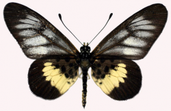

<a name="readme-top"></a>

<br />
<div align="center">
  <a href="https://github.com/kitkot2/CircEIS">
    
  </a>

<h3 align="center">CircEIS</h3>

  <p align="center">
    Circumference fitting for EIS
    <br />
    <a href="https://github.com/kitkot2/CircEIS"><strong>Files</strong></a>
    <br />
    <br />
    <a href="https://github.com/kitkot2/CircEIS/issues">Report an error</a>
  </p>
</div>


<details>
  <summary>Table of contents</summary>
  <ol>
    <li>
      <a href="#About">About</a>
      <ul>
        <li><a href="#Libraries">Libraries</a></li>
      </ul>
    </li>
    <li><a href="#Setup">Setup</a></li>
    <li><a href="#Contacts">Contacts</a></li>
  </ol>
</details>


## About the project

<p align="right">(<a href="#readme-top">up</a>)</p>

### Libraries

<p align="right">(<a href="#readme-top">up</a>)</p>


## Setup

1. Copy repository
   ```sh
   git clone https://github.com/kitkot2/CircEIS.git
   ```
   or download .zip file
2. Make shure you have python and pip installed
3. Using your command line change directory to CircEIS
  ```sh
   cd path_to_the_project/
   ```
4. To install all required libraries write for windows:
   ```sh
   pip install -r requirements.txt
   ```
   for mac:
   ```sh
   pip3 install -r requirements.txt
   ```
5. After installation, run main.py using command line or your compiler

<p align="right">(<a href="#readme-top">up</a>)</p>

## Contacts

Nikita Kotenko - kotenko.na@phystech.edu

Project Link: [https://github.com/kitkot2/CircEIS](https://github.com/kitkot2/CircEIS)

<p align="right">(<a href="#readme-top">up</a>)</p>

[contributors-shield]: https://img.shields.io/github/contributors/kitkot2/CircEIS.svg?style=for-the-badge
[contributors-url]: https://github.com/kitkot2/CircEIS/graphs/contributors
[forks-shield]: https://img.shields.io/github/forks/kitkot2/CircEIS.svg?style=for-the-badge
[forks-url]: https://github.com/kitkot2/CircEIS/network/members
[stars-shield]: https://img.shields.io/github/stars/kitkot2/CircEIS.svg?style=for-the-badge
[stars-url]: https://github.com/kitkot2/CircEIS/stargazers
[issues-shield]: https://img.shields.io/github/issues/kitkot2/CircEIS.svg?style=for-the-badge
[issues-url]: https://github.com/kitkot2/CircEIS/issues
